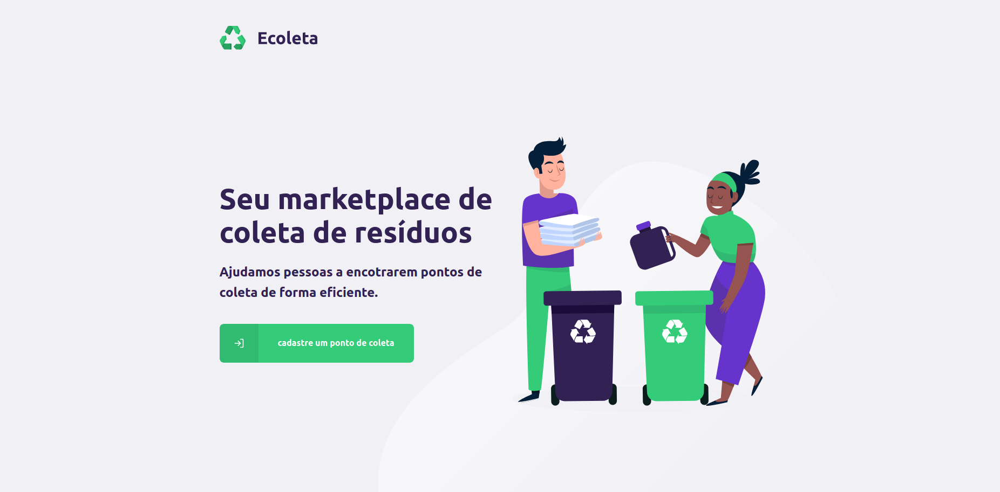
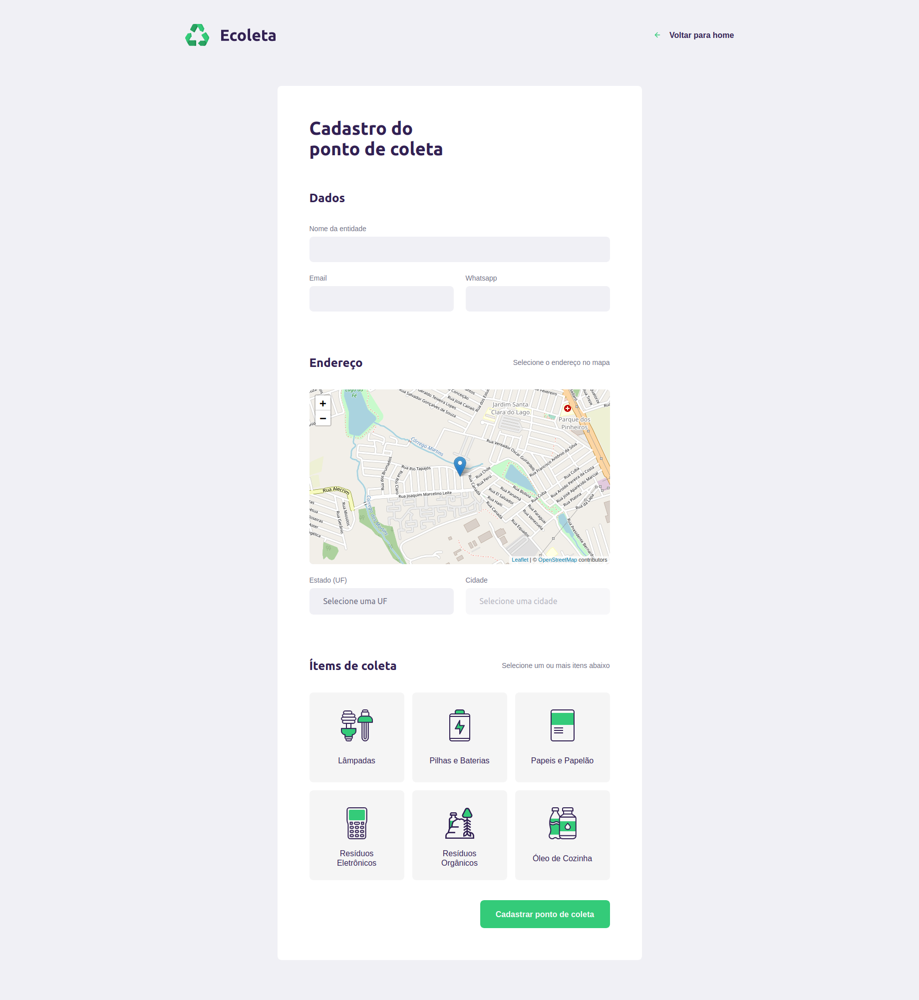

<h1 align="center"> 
  
	<h4>🚧 NextLevelWeek 1.0 🚀 em construção... 🚧</h4>
</h1>

<h1 align="center">
    
</h1>

<p align="center">
  

  

  <a href="https://www.twitter.com/ueslu/">
    
  </a>
	
  
  <a href="https://github.com/WeslleyNasRocha/Ecoleta-Fullstack/commits/master">
    
  </a>

  
   <a href="https://github.com/WeslleyNasRocha/Ecoleta-Fullstack/stargazers">
    
  </a>
</p>

## 💻 Sobre o projeto

♻️ Ecoleta - é uma forma de conectar empresas e entidades de coleta de resíduos orgânicos e inorgânicos as pessoas que precisam descartar seus resíduos de maneira ecológica.

As empresas ou entidades poderão se cadastrar na plataforma web enviando:

- uma imagem do ponto de coleta
- nome da entidade, email e whatsapp
- e o endereço para que ele possa aparecer no mapa
- além de selecionar um ou mais ítens de coleta:
  - lâmpadas
  - pilhas e baterias
  - papéis e papelão
  - resíduos eletrônicos
  - resíduos orgânicos
  - óleo de cozinha

Os usuários terão acesso ao aplicativo móvel, onde poderão:

- navegar pelo mapa para ver as instituições cadastradas
- entrar em contato com a entidade através do E-mail ou do WhatsApp

Projeto desenvolvido durante a **NLW - Next Level Week** oferecida pela [Rocketseat](rocketseat).
O NLW é uma experiência online com muito conteúdo prático, desafios e hacks onde o conteúdo fica disponível durante uma semana.

## 🎨 Layout

O layout da aplicação está disponível no Figma:

<a href="https://www.figma.com/file/9TlOcj6l7D05fZhU12xWT3/Ecoleta-(Booster)">
  
</a>

### Web

<p align="center" style="display: flex; align-items: flex-start; justify-content: center;">
  

  
</p>

## 🛠 Tecnologias

As seguintes ferramentas foram usadas na construção do projeto:

- [NextJs][next]
- [Prisma2][prisma]
- [Nexus Schema][nexus-schema]
- [Apollo][apollo]
- [React Native][rn]
- [TypeScript][typescript]

## 🚀 Como executar o projeto

O projeto foi desenvolvido utilizando o nextjs tanto para o back-end quanto para o front end, ja para o mobile, é necessario rodar este projeto para conectar-se à api

### Pré-requisitos

Antes de começar, você vai precisar ter instalado em sua máquina as seguintes ferramentas:
[Git](https://git-scm.com), [Node.js][nodejs].
Além disto é bom ter um editor para trabalhar com o código como [VSCode][vscode]

### 🎲 Rodando a Aplicação (servidor)

**Clone este repositório**

```bash
$ git clone https://github.com/WeslleyNasRocha/Ecoleta-Fullstack
```

**Acesse a pasta do projeto no terminal/cmd**

```bash
$ cd Ecoleta-Fullstack
```

**Instale as dependências**

```bash
$ npm install
```

**Comente o seguinte conteudo no arquivo `prisma/schema.prisma`**

```prisma
datasource db {
 provider = "postgresql"
 url      = env("DATABASE_URL")
}
```

**E descomente o seguinte conteudo no arquivo `prisma/schema.prisma`**

```prisma
datasource sqlite {
  provider = "sqlite"
  url      = "file:./dev.sqlite"
}
```

**Execute o seed do banco de dados**

```bash
$ npm run prisma:seed
```

**Execute o projeto em modo de desenvolvimento**

```bash
$ npm run dev
```

A aplicação inciará na porta:3000 acesse http://localhost:3000 para a aplicação web ou http://localhost:3000/api/graphql para o servidor

### 📱Rodando a aplicação mobile

🚧 Em construção... 🚧

## 😯 Como contribuir para o projeto

1. Faça um **fork** do projeto.
2. Crie uma nova branch com as suas alterações: `git checkout -b my-feature`
3. Salve as alterações e crie uma mensagem de commit contando o que você fez: `git commit -m "feature: My new feature"`
4. Envie as suas alterações: `git push origin my-feature`
   > Caso tenha alguma dúvida confira este [guia de como contribuir no GitHub](https://github.com/firstcontributions/first-contributions)

## 📝 Licença

Este projeto esta sobe a licença MIT.

Feito com ❤️ e ☕ por Weslley Rocha

[nodejs]: https://nodejs.org/
[typescript]: https://www.typescriptlang.org/
[next]: https://nextjs.org/
[prisma]: https://www.prisma.io/
[nexus-schema]: https://nexus.js.org/
[apollo]: https://www.apollographql.com/
[rn]: https://facebook.github.io/react-native/
[yarn]: https://yarnpkg.com/
[vscode]: https://code.visualstudio.com/
[vceditconfig]: https://marketplace.visualstudio.com/items?itemName=EditorConfig.EditorConfig
[license]: https://opensource.org/licenses/MIT
[vceslint]: https://marketplace.visualstudio.com/items?itemName=dbaeumer.vscode-eslint
[prettier]: https://marketplace.visualstudio.com/items?itemName=esbenp.prettier-vscode
[rocketseat]: https://rocketseat.com.br
